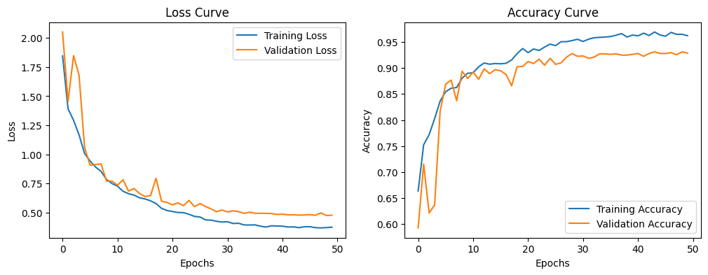

# 🎧 CNN-Based Environmental Sound Classification

This machine learning project uses a Convolutional Neural Network (CNN) to classify environmental sounds such as **car horn**, **scream**, **dog bark**, and **other ambient noises**. Audio files are converted into Mel spectrograms and passed through a CNN architecture for training, evaluation, and real-time prediction.

---

## 🧠 Project Overview

- Convert raw audio into **Mel spectrograms**
- Use a **Convolutional Neural Network (CNN)** for feature extraction
- Train the model to classify sound into 4 categories
- Apply **data augmentation**, **dropout**, and **regularization** for generalization
- Save preprocessed datasets and model for reuse and deployment
- Run batch predictions on unseen audio folders

---

## 📦 Technologies Used

- Python, TensorFlow, Keras
- Librosa, NumPy, Pandas
- scikit-learn, Matplotlib
- Google Colab (for training on Drive)

---

## 📊 Training Performance


### 📈 Loss Curve and Accuracy Curve

*Shows reduction in training and validation loss over 50 epochs.*
*Model reaches over 95% training accuracy and ~92% validation accuracy.*

---

## 🧪 Evaluation Metrics

- **Test Accuracy:** ~92%
- **Classification Report:** Includes precision, recall, F1-score per class
- **Model Format:** Saved as `.keras` for deployment
- **Inference Support:** Batch prediction from folder of audio files

---

## 📂 Repository Structure

- `cnn_audio_classification_pipeline.ipynb` — Full training and evaluation code
- `cnn_audio_classifier_model.keras` — Trained model file
- `cnn_environmental_sound_classifier_report.pdf` — Final project report
- `images/` — Contains training curve visualizations
- `README.md` — Project overview and documentation


---

## 🚀 How to Run

1. Clone the repo:
   ```bash
   git clone https://github.com/naomi-afrin/cnn-environmental-sound-classification.git
   cd cnn-environmental-sound-classification
---
## 📬 Contact

If you have any questions or are interested in collaboration, feel free to reach out:  
📧 naomiafrin12@gmail.com  
🔗 [LinkedIn](https://www.linkedin.com/in/naomi-jalil-240160227/)
